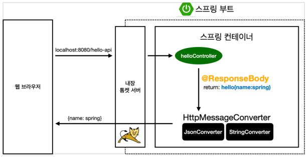

# 섹션2. 스프링 웹개발 기초

스프링에서 웹개발하는 세 가지 방법: 정적 컨텐츠, MVC와 템플릿 엔진, API

# 1. 정적 컨텐츠

스프링 부트에서 정적 컨텐츠 기능 기본으로 제공

`/resources/static/hello-static.html` 파일 → `localhost:8080/hello-static.html` 접속 시 제공

## 동작 구조(간단히)

1. 컨트롤러 **우선 확인**
2. resources: static/ 확인


# 2. MVC와 템플릿 엔진

MVC(Model, View, Controller)

```
💡 관심사의 분리
```

| 요소 | 역할 | 장고의 그것 |
| --- | --- | --- |
| View | 화면 그리는 것 | Template |
| Controller | 비즈니스 로직과 내부적인 것 | View |
| Model | 화면 그리는데 필요한 내용을 담은 것 | context (??) |

static과 차이: 날 것의 HTML이 아닌 변환된 HTML을 반환

## 예시

`HelloController.java`

```java
@GetMapping("hello-mvc")
public String helloMvc(@RequestParam("name") String name, Model model) { 
    //                                ^
    model.addAttribute("name", name);
    return "hello-template";
}
```

name이라는 query parameter를 받도록 설정

^

## 동작 구조


### `viewResolver`

: 템플릿을 찾고 템플릿 엔진을 연결

이런 `viewResolver`가 리턴값 “hello-template”과 모델을 이용해 변환된 HTML을 반환


# 3. API 방식

## `@ResponseBody`

: HTTP Body에 이 메소드의 리턴값을 쓰겠다

없을 때와의 차이: 메소드에 Model도 없고 View도 없다

### 동작

문자열을 주면 그대로 HTTP Body에 넣어서 응답하지만 자바 객체를 주면 (기본값) JSON으로 변환해 응답한다. 

장고는 HttpResponse와 JsonResponse가 분리되어 있던 것과 다르다. DRF의 Response와 좀 더 닮았다. 하지만 DRF의 Response에는 serialize된 데이터를 인자로 줘야했지만 HttpMessageConverter는 이마저도 요구하지 않는다. 

### 예시

```java
@GetMapping("hello-string")
@ResponseBody
public String helloString(@RequestParam("name") String name) { // model이 없다
  return "hello " + name; // template 이름이 아니다. 응답할 string 그 자체다
}
```

```java
@GetMapping("hello-api")
@ResponseBody
public Hello helloApi(@RequestParam("name") String name) {
    Hello hello = new Hello();
    hello.setName(name);
    return hello; // 자바 객체를 리턴했다
}

static class Hello {
    private String name;

    public String getName() {
        return name;
    }

    public void setName(String name) {
        this.name = name;
    }
}
```

## 동작 구조

`@ResponseBody` 때문에 `viewResolver` 대신 `HttpMessageConverter`가 동작

리턴값이 문자열이면 `StringConverter`가 동작 (기본값: `StringHttpMessageConverter`)

리턴값이 객체면 `JsonConverter`가 동작 (기본값: `MappingJackson2HttpMessageConverter`)



## `HttpMessageConverter`

byte 처리 등 여러 경우에 대한 `HttpMessageConverter`가 기본으로 등록되어 있음

클라이언트의 HTTP Accept 헤더와 서버의 컨트롤러 반환 타입 정보, 이렇게 둘을 조합해서 `HttpMessageConverter`의 종류가 결정됨